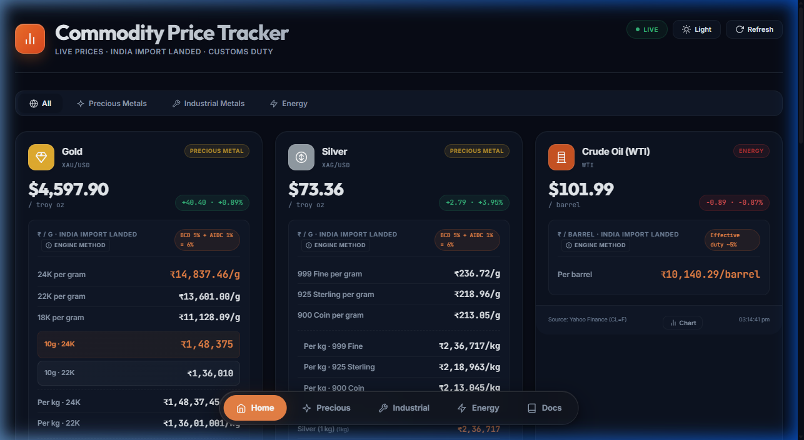
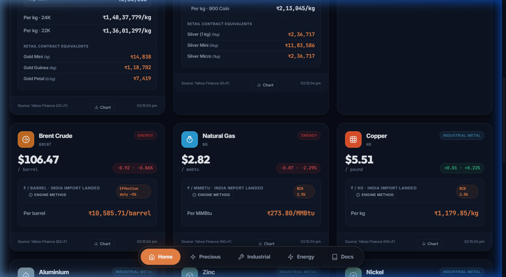
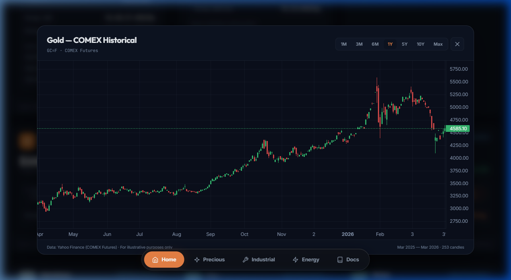
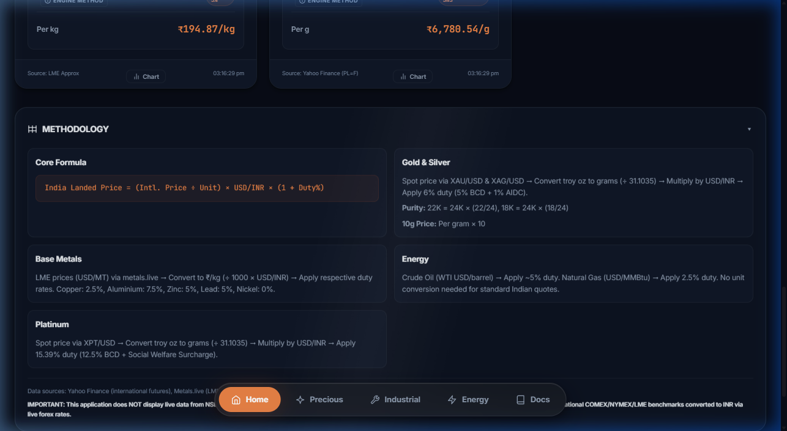
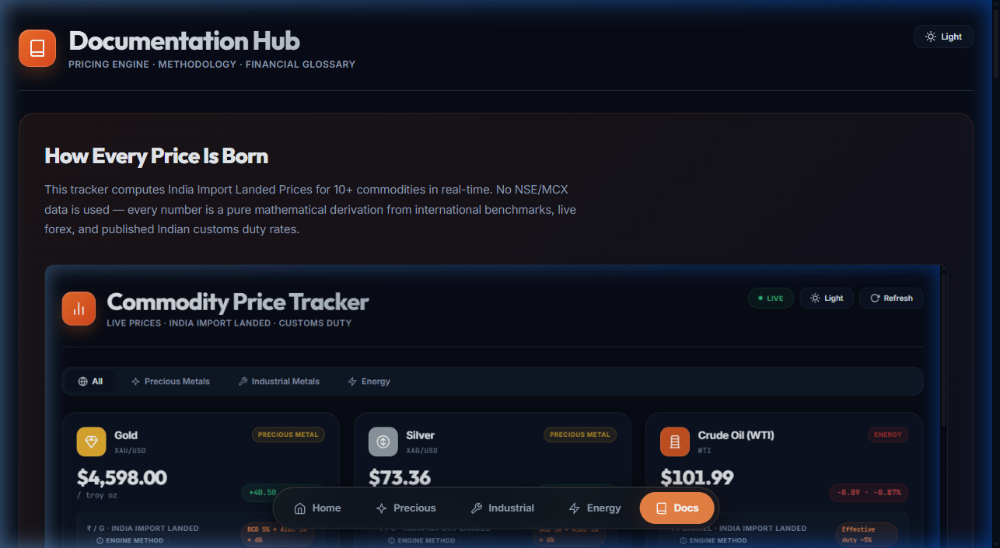
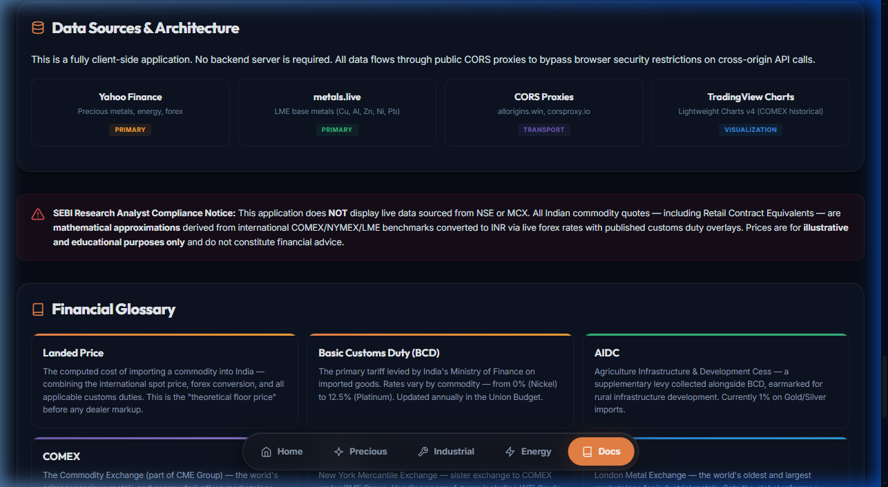

<p align="center">
  
</p>

# 📊 India Commodity Price Tracker — Import Landed Price Engine

> **Live Dashboard** that computes real-time India Import Landed Prices for Gold, Silver, Platinum, Crude Oil, Natural Gas, Copper, Aluminium, Zinc, Nickel & Lead — purely from international benchmarks + live forex + customs duty math.
>
> 🌐 **Live at:** [commodity.mrchartist.com](https://commodity.mrchartist.com/)
>
> Built by [@mr_chartist](https://twitter.com/mr_chartist)

<p align="center">
  <a href="https://commodity.mrchartist.com/"></a>
  <a href="https://twitter.com/mr_chartist"></a>
  <a href="https://buymeacoffee.com/mrchartist"></a>
  
  
</p>

---

## ✨ Features

| Feature | Description |
|---------|-------------|
| **10+ Commodities** | Gold, Silver, Platinum, Crude Oil (WTI + Brent), Natural Gas, Copper, Aluminium, Zinc, Nickel & Lead |
| **Live Auto-Refresh** | Pulls fresh data every ~5 seconds from COMEX, NYMEX, LME & Yahoo Finance |
| **India Import Landed ₹** | Applies BCD + AIDC customs duties with live USD/INR forex conversion |
| **Purity Variants** | 24K / 22K / 18K Gold, 999 / 925 / 900 Silver — auto-calculated |
| **Retail Contract Equivalents** | MCX-style lot values: Gold Mini (100g), Gold Guinea (8g), Gold Petal (0.5g), Silver (1kg/5kg/Micro) |
| **Interactive COMEX Charts** | TradingView Lightweight Charts with 1M to Max timeframe toggles |
| **Category Filtering** | One-click filter: Precious Metals · Industrial Metals · Energy |
| **Documentation Hub** | Full methodology engine docs, duty rate matrix & 15-term financial glossary |
| **Dark / Light Mode** | Premium glassmorphic UI with OLED-optimized dark theme |
| **Zero Backend** | 100% client-side — no server, no database, no login required |
| **SEO Optimized** | JSON-LD structured data, Open Graph meta, AI discoverability tags |

---

## 📸 Section-by-Section Walkthrough

### 1. Live Dashboard — Precious Metals & Energy

The default landing view showing **real-time COMEX/NYMEX prices** with:

- **Price Cards** — International spot price + percentage change badge
- **India Landed Breakdown** — Per-gram prices across 24K/22K/18K Gold, 999/925/900 Silver
- **10g & Per-kg Aggregates** — Direct comparison with Indian retail benchmarks
- **Retail Contract Equivalents** — Gold Mini, Guinea, Petal lot values
- **Duty Badges** — Visual BCD + AIDC breakdowns on each card


---

### 2. Energy & Industrial Metals

Scrolling reveals the full commodity spectrum:

- **Brent Crude & Natural Gas** — NYMEX/ICE futures with effective duty overlay
- **LME Base Metals** — Copper, Aluminium, Zinc, Nickel, Lead in ₹/kg
- **Source Attribution** — Each card shows its data origin (Yahoo Finance / LME Approx)



---

### 3. Interactive COMEX Charts

Click any **"Chart"** button to launch a full-screen historical chart:

- **TradingView Lightweight Charts** — Professional candlestick rendering
- **7 Timeframes** — 1M, 3M, 6M, 1Y, 5Y, 10Y, Max
- **COMEX Futures Data** — Real historical data from Yahoo Finance



---

### 4. Methodology Engine

The expandable methodology panel explains the entire pricing pipeline:

- **Core Formula** — `India Landed ₹ = (Intl. Price ÷ Unit) × USD/INR × (1 + Duty%)`
- **Metal-Specific Breakdowns** — Gold/Silver, Base Metals, Energy, Platinum
- **Compliance Notice** — No NSE/MCX data disclaimer



---

### 5. Documentation Hub

A dedicated `/docs.html` page with comprehensive technical documentation:

- **4-Step Visual Pipeline** — Step-by-step pricing engine walkthrough
- **Duty Rate Matrix** — Complete BCD/AIDC table for all metals
- **Purity Formulas** — 24K→22K→18K conversion table with examples
- **Data Source Cards** — Yahoo Finance, Metals.live, CORS Proxies, Lightweight Charts



---

### 6. Financial Glossary

A 15-term glossary covering essential commodity trading terminology:

- **Landed Price, BCD, AIDC** — Import cost concepts
- **COMEX, NYMEX, LME** — Exchange definitions
- **Troy Ounce, Karat, Fineness** — Measurement units
- **CAD, Windfall Tax, MMBtu** — Macro concepts



---

## 🛠️ Tech Stack

| Technology | Usage |
|-----------|-------|
| **HTML5** | Single-file dashboard with semantic structure |
| **CSS3** | Custom properties, OLED dark mode, glassmorphism, ambient orbs |
| **Vanilla JavaScript** | Core pricing engine — `app.js` (45KB, zero dependencies) |
| **Lightweight Charts** | TradingView's open-source charting library v4.1.3 |
| **Yahoo Finance** | Precious metals, energy futures, forex (USDINR=X) |
| **Metals.live** | LME spot data for Copper, Aluminium, Zinc, Nickel, Lead |
| **CORS Proxies** | allorigins.win + corsproxy.io for client-side API access |

## 📂 Project Structure

```
Commodity Price Tracker/
├── index.html             # Main dashboard (category tabs, cards, chart modal)
├── docs.html              # Documentation Hub (methodology, glossary)
├── app.js                 # Core pricing engine (45KB, zero dependencies)
├── style.css              # Premium dark/light theme (30KB)
├── vercel.json            # Vercel deployment config
├── package.json           # npm scripts (dev server)
├── .gitignore             # Node.js gitignore
├── docs/
│   └── screenshots/       # README screenshots
│       ├── 01_hero_dashboard.png
│       ├── 02_energy_industrial.png
│       ├── 03_chart_modal.png
│       ├── 04_methodology.png
│       ├── 05_docs_hub.png
│       └── 06_glossary.png
└── README.md              # This file
```

## 🚀 Quick Start

```bash
# Clone the repository
git clone https://github.com/MrChartist/commodity-price-tracker.git
cd commodity-price-tracker

# Serve locally (no build step needed!)
npx serve .
# → Open http://localhost:3000
```

That's it. No `npm install`, no build tools, no environment variables. The entire app runs client-side.

## 📊 Data Flow

```
Yahoo Finance CDN ──→ CORS Proxy ──→ app.js (browser)
  · GC=F (Gold)                        │
  · SI=F (Silver)                      ├── Parse JSON
  · CL=F (WTI Crude)                   ├── Convert Units (oz→g, MT→kg)
  · BZ=F (Brent)                       ├── Apply USD/INR Forex
  · NG=F (Natural Gas)                 ├── Layer Import Duties
  · HG=F (Copper)                      └── Render Cards + Charts
  · USDINR=X (Forex)

Metals.live API ──→ CORS Proxy ──→ app.js
  · Copper, Aluminium, Zinc
  · Nickel, Lead (LME spot)
```

## 🔐 Compliance Notice

> **SEBI Research Analyst Notice:** This application does **NOT** display live data sourced from the National Stock Exchange (NSE) or Multi Commodity Exchange (MCX).
>
> All Indian commodity quotes — including "Retail Contract Equivalents" — are strict **mathematical approximations** derived from international COMEX/NYMEX/LME benchmarks converted to INR via live forex rates with published customs duty overlays.
>
> *Prices are for illustrative and educational purposes only and do not constitute financial advice.*

## ☁️ Deployment

### Vercel (Recommended)
```bash
# Deploy to Vercel (zero-config)
npx vercel --prod
```
The repo includes a `vercel.json` with SPA rewrite rules.

### Any Static Host
Since there's no backend, you can deploy to **Netlify, Cloudflare Pages, GitHub Pages**, or any static file host. Just drop the files.

## 💖 Support This Project

If this tool helps you track commodity prices or understand import duty mechanics, consider supporting my work:

<p align="center">
  <a href="https://buymeacoffee.com/mrchartist"></a>
</p>

Your support keeps these open-source financial tools free for the entire Indian trading community. 🙏

## 🔗 Links

- **Live Dashboard:** [commodity.mrchartist.com](https://commodity.mrchartist.com/)
- **FII/DII Data Terminal:** [fii-diidata.mrchartist.com](https://fii-diidata.mrchartist.com/)
- **X (Twitter):** [@mr_chartist](https://twitter.com/mr_chartist)
- **Support:** [Buy Me A Coffee](https://buymeacoffee.com/mrchartist)

---

<p align="center">
  <b>Made with ❤️ by Mr. Chartist</b><br>
  <i>Decoding commodity prices for the Indian retail trader.</i>
</p>
