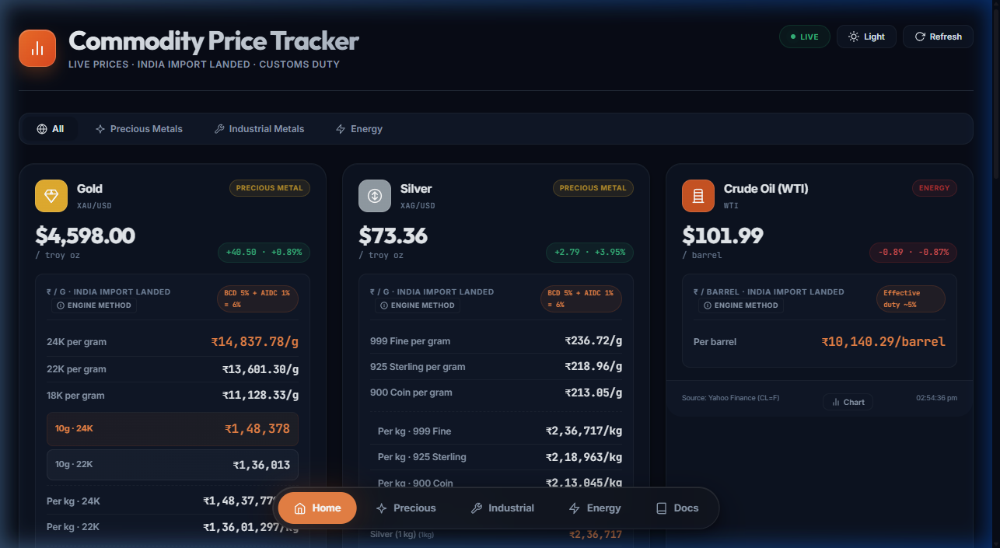
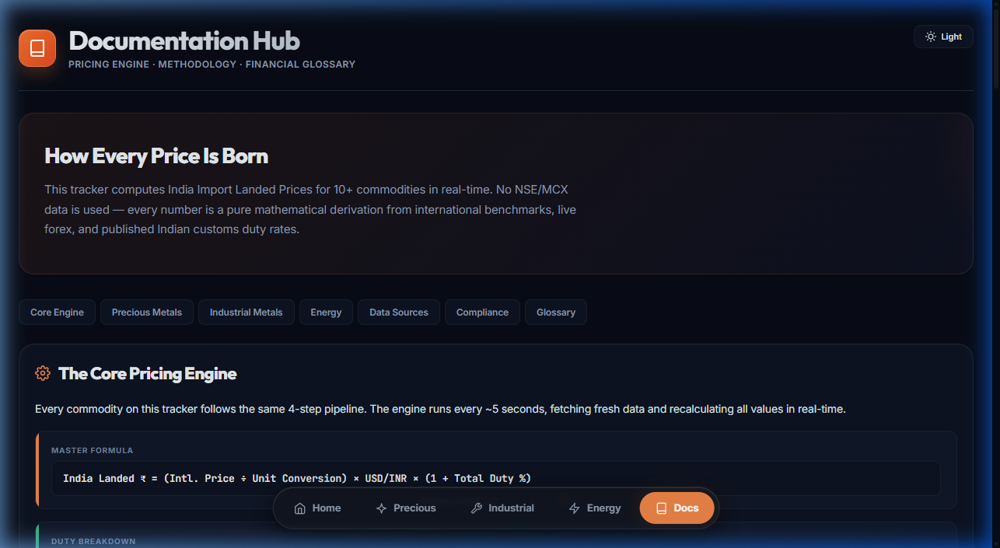

<p align="center">
  
</p>

# 📊 India Commodity Price Tracker

> **Live Dashboard** calculating true India Import Landed Prices for Gold, Silver, Crude Oil, and Base Metals using pure mathematical derivations.
>
> 🌐 **Live at:** [commodity.mrchartist.com](https://commodity.mrchartist.com/)
>
> Built by [@mr_chartist](https://twitter.com/mr_chartist) | [Sponsor my work ❤️](https://buymeacoffee.com/mrchartist)

---

## ✨ Features

| Feature | Description |
|---------|-------------|
| **Real-Time Data** | Auto-refreshes every ~5 seconds using Yahoo Finance & Metals.live APIs |
| **Import Landed Logic** | Automatically applies BCD & AIDC customs duties + Forex conversion |
| **Precious Metals** | 24K, 22K, 18K Gold variants + 999, 925, 900 Silver equivalents |
| **Industrial & Energy** | LME tracking for Copper, Zinc, Aluminium & NYMEX/ICE for Crude |
| **Retail Contracts** | Displays MCX-equivalent lot values (Mini, Guinea, Petal, etc.) |
| **Interactive Charts** | Built-in Lightweight Charts for historical trend visualization |
| **Dark Mode UI** | Premium glassmorphic design and OLED-optimized dark theme |
| **Serverless Architecture** | Pure client-side application running seamlessly without a backend |

---

## 📸 Dashboard & Documentation

### 1. Main Tracker
A sleek, categorized dashboard showing live commodity quotes mathematically converted into Indian Rupees (₹) with all applicable import duties applied.


### 2. Documentation Hub
A highly detailed technical hub explaining the core 4-step derivation engine, duty rates, and a full Financial Glossary for novice traders.



---

## 🛠️ Tech Stack & Architecture

This application operates **entirely horizontally mapped to the client**, avoiding backend infrastructure costs.

| Technology | Usage |
|-----------|-------|
| **HTML5 & CSS3** | Custom typography, ambient animations, and responsive CSS grids |
| **Vanilla JavaScript** | Core logical engine (`app.js`) handling live fetches and math |
| **Lightweight Charts** | TradingView's open-source library for the historical pop-ups |
| **CORS Proxies** | Client-side fetching bypassing browser security restrictions |
| **Yahoo Finance (YF)** | Forex, Precious Metals, and Energy live ticker sources |
| **Metals.live** | Alternative aggregator for London Metal Exchange (LME) spot quotes |

### The 4-Step Pricing Pipeline
1. **Source Benchmark:** Fetch global USD denominator (COMEX, NYMEX, LME).
2. **Convert Units:** Transform Troy Ounces or Metric Tonnes into Grams or Kilograms.
3. **Forex Overlay:** Multiply by live spot USD/INR.
4. **Duty Application:** Add respective Indian BCD, AIDC, and Surcharges.

---

## 🚀 Quick Start (Development)

Want to run the tracker locally? Simply clone the repo and serve the directory.

```bash
# 1. Clone the repository
git clone https://github.com/mrchartist/commodity-price-tracker.git

# 2. Navigate to directory
cd commodity-price-tracker

# 3. Serve the directory (requires Node.js)
npx serve .
# → Server runs on http://localhost:3000
```

---

## 🔐 Compliance Notice

**SEBI Research Analyst Notice:** This application does **NOT** display live data sourced from the National Stock Exchange (NSE) or Multi Commodity Exchange (MCX). 

All Indian commodity quotes displayed—including "Retail Contract Equivalents"—are strict **mathematical approximations**. They are derived from international benchmarks converted to INR via live forex rates with published customs duty overlays. 

*Prices are for illustrative and educational purposes only and do not constitute financial advice. Physical physical markets may carry dealer premiums outside of this derived "Landed Price" floor.*

---

## 🔗 Links

- **Live Dashboard:** [commodity.mrchartist.com](https://commodity.mrchartist.com/)
- **X (Twitter):** [@mr_chartist](https://twitter.com/mr_chartist)
- **Support:** [Buy Me A Coffee](https://buymeacoffee.com/mrchartist)

---

<p align="center">
  <b>Made with ❤️ by Mr. Chartist</b><br>
  <i>Empowering retail traders with institutional-grade data.</i>
</p>
