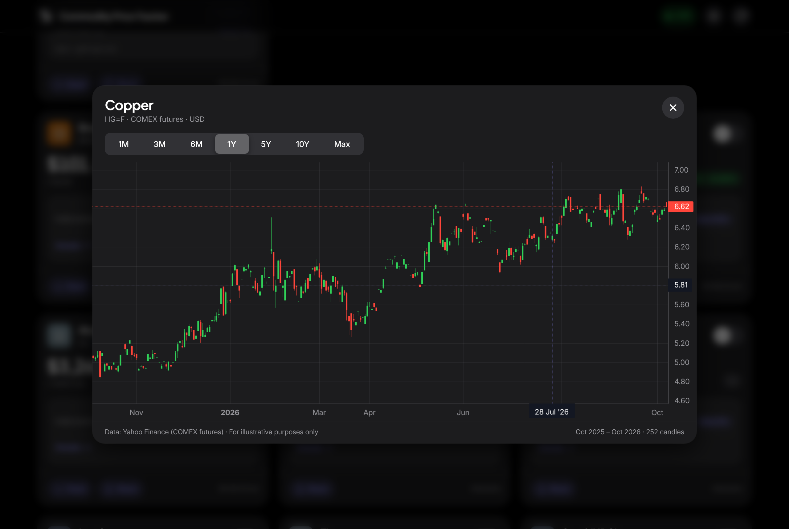
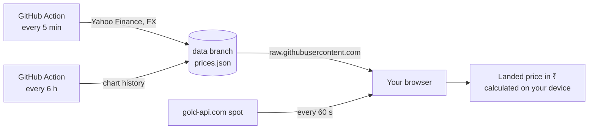

<p align="center">
  
</p>

<h1 align="center">India Commodity Price Tracker</h1>

<p align="center">
  <b>What does it actually cost to bring it into India?</b><br>
  Live import landed prices in rupees for 33 commodities, calculated from international benchmarks,<br>
  the live USD/INR rate and Indian customs duty. Free, open source, no login, no tracking.
</p>

<p align="center">
  <a href="https://commodity.mrchartist.com/"></a>
  
  
  
  
  
</p>

<p align="center">
  
</p>

<p align="center">
  
  
</p>

---

## What it does

International prices are quoted in dollars, per ounce, barrel or bushel. Indian buyers think in rupees, per gram, kilogram or quintal, after duty. This tracker does that conversion in the open:

```
India landed price = (international price ÷ unit conversion) × USD/INR × (1 + duty)
```

Each card shows one headline rupee price. Open **Details** for the full breakdown (purities, per-kg and per-10g values, contract-lot equivalents), the duty applied and the data source.

| | |
|---|---|
| **33 commodities** | Precious metals, industrial and battery metals, energy, and agri: gold, silver, platinum, palladium, copper, aluminium, steel, crude oil, natural gas, wheat, cotton, coffee, palm oil and more |
| **Indian units** | Gold in ₹/g and ₹/10g (24K, 22K, 18K), grains in ₹/quintal, oils and softs in ₹/kg, lumber in ₹/cu ft |
| **Duty aware** | BCD, AIDC and SWS per commodity, including date-based changes (for example cotton) |
| **Honest status** | Every price is labelled Live, Cached, Stale or Indicative, with its real age |
| **Charts** | Candlestick history from 1 month to the full available range |
| **Watchlist and share** | Star your commodities, copy or share a price, link straight to a category or chart |
| **Works offline** | Installable as an app; shows the last known prices when you are offline |
| **Clean by design** | Light and dark themes, keyboard friendly (`/` to search, `Esc` to close), accessible, fast on a phone |

## How the data stays live

Yahoo Finance does not allow direct requests from a browser, so a scheduled GitHub Action fetches it and publishes a small static file. Gold, silver, platinum and palladium spot prices are read directly by the browser.


```mermaid
flowchart LR
  A[GitHub Action<br/>every 5 min] -->|Yahoo Finance, FX| B[(data branch<br/>prices.json)]
  C[GitHub Action<br/>every 6 h] -->|chart history| B
  B -->|raw.githubusercontent.com| D[Your browser]
  E[gold-api.com spot] -->|every 60 s| D
  D --> F[Landed price in ₹<br/>calculated on your device]
```

| Data | Source | How fresh |
|---|---|---|
| Gold, silver, platinum, palladium | gold-api.com spot, read by the browser | About every minute |
| Futures, USD/INR, FX strip | Yahoo Finance via the `data` branch | Up to about 5 minutes |
| Chart history | Yahoo Finance via the `data` branch | Refreshed every 6 hours |
| Nine commodities with no free live feed | Typed-in indicative levels in `app.js` | As of 2026-06-12. **Needs verification** |

The nine indicative commodities (zinc, nickel, lead, tin, iron ore, lithium, cobalt, canola oil, palm oil) are always badged **Indicative**. Their feeds are not freely available, and a stale feed shown as live would be worse than an honest label.

Notes on freshness: GitHub can delay scheduled runs at busy times, and it pauses schedules in a repository with no activity for 60 days. The app flags any price older than 20 minutes as Stale.

## Run it locally

Needs Node.js 18 or later. No packages to install.

```bash
git clone https://github.com/MrChartist/commodity-price-tracker.git
cd commodity-price-tracker
npm run dev
```

Open <http://localhost:3000>. The local server generates the same live data files the GitHub Action publishes, so it works without any setup.

## Fork it and run your own

1. **Fork** this repository.
2. In **Settings → Actions → General**, allow workflows to run, with read and write permission.
3. In **Actions**, run **Update prices** and **Update chart history** once (they also run on a schedule). This creates the `data` branch.
4. In **Settings → Pages**, set the source to **GitHub Actions**, then run **Deploy site**.
5. Edit `config.js` and point `dataBase` at your fork:
   ```js
   window.CPT_CONFIG = {
     dataBase: 'https://raw.githubusercontent.com/<you>/commodity-price-tracker/data',
   };
   ```
6. Optional: change the `CNAME` file to your own domain, or delete it to use `<you>.github.io/commodity-price-tracker`.

## Project structure

```
index.html · docs.html · about.html · 404.html   Pages
app.js            Commodity table, duty rules, pricing engine, UI logic
style.css         Design system (light and dark)
config.js         Where live data is read from
sw.js             Offline support
scripts/          Data fetchers, publisher and local dev server (Node, no packages)
.github/workflows Price updates, chart updates, site deploy
assets/ · brand/ · icons/   Screenshots, Mr. Chartist logo, app icons
```

Methodology, the duty matrix, unit conversions and a searchable glossary are in [docs.html](docs.html).

## Accuracy and limits

- Quotes are derived from international benchmarks. This is **not** NSE or MCX data, and Indian market prices will differ.
- Duty rates and their effective dates are entered by hand from public notifications. **Needs verification** against the latest CBIC notifications before you rely on them. Found a wrong rate? Open a [data correction](../../issues/new?template=data_correction.yml).
- Futures contracts roll, so a day change can occasionally look odd around a roll.
- For information and education only. Not financial or trading advice.

## Contributing

Issues and pull requests are welcome. See [CONTRIBUTING.md](CONTRIBUTING.md) for how to run, test and propose changes, and [SECURITY.md](SECURITY.md) to report a security problem. Release notes are in [CHANGELOG.md](CHANGELOG.md).

Good first contributions: a corrected duty rate with its source, a free live feed for any indicative commodity, translations, and accessibility fixes.

## Credits

Data: [Yahoo Finance](https://finance.yahoo.com), [gold-api.com](https://gold-api.com), [ExchangeRate-API](https://www.exchangerate-api.com). Charts: [TradingView Lightweight Charts](https://github.com/tradingview/lightweight-charts) (Apache-2.0).

Built by [**@MrChartist**](https://mrchartist.com) · [Twitter](https://twitter.com/mr_chartist) · [GitHub](https://github.com/MrChartist) · [Buy me a coffee](https://buymeacoffee.com/mrchartist)

Released under the [MIT License](LICENSE).
