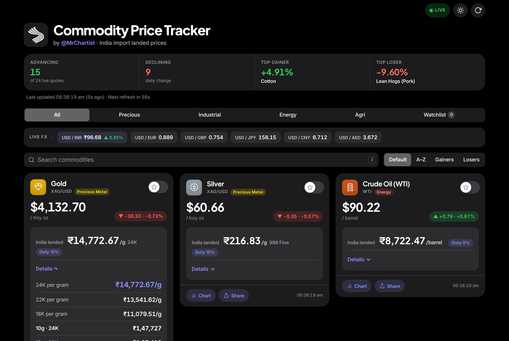
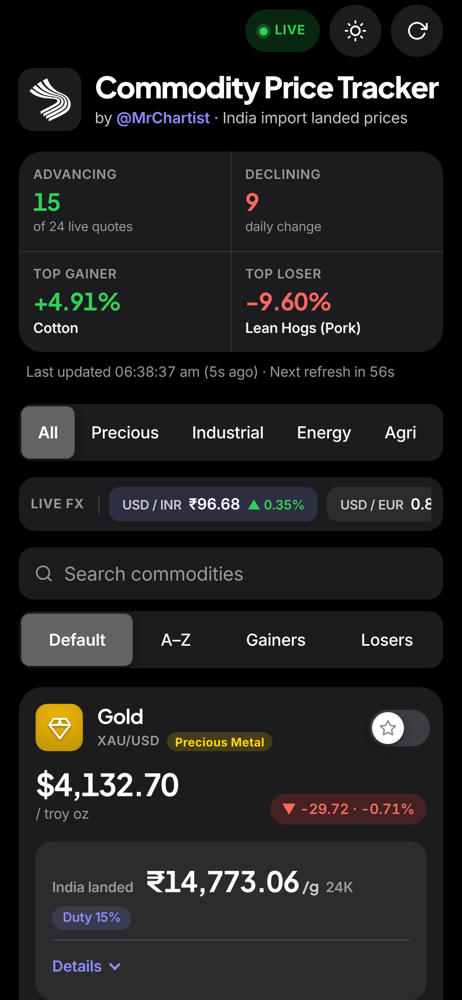

<p align="center">
  
</p>

<h1 align="center">India Commodity Price Tracker</h1>

<p align="center">
  Import landed prices in rupees for 33 commodities, from international futures, live USD/INR and Indian customs duty.<br>
  Built by <a href="https://github.com/MrChartist"><b>Mr. Chartist</b></a> · Part of the <a href="https://mrchartist.com">mrchartist.com</a> ecosystem
</p>

<p align="center">
  <a href="https://commodity.mrchartist.com/"></a>
  
  
  
  <a href="https://twitter.com/mr_chartist"></a>
  <a href="https://buymeacoffee.com/mrchartist"></a>
</p>

<p align="center">
  
</p>

<p align="center">
  
  
</p>

## How it works

```
India landed ₹ per unit = (international price ÷ unit divisor) × USD/INR × (1 + duty rate)
```

Prices come from international futures (Yahoo Finance) or, where no free live feed exists, from manually updated indicative levels. The tracker does not use NSE or MCX data. See [docs.html](docs.html) for the full method, the duty matrix and a glossary.

## Features

| Feature | Details |
|---|---|
| 33 commodities | 4 precious metals, 10 industrial and battery metals, 3 energy, 16 agri (24 live futures feeds, 9 indicative levels) |
| Landed prices in Indian units | ₹/g, ₹/10 g, ₹/kg, ₹/quintal, ₹/tonne, ₹/barrel, ₹/MMBtu, ₹/cu ft |
| Date-aware duty engine | Time-bound duties, for example cotton (0% up to 31 Oct 2026, then 11%) |
| Purity and contracts | 24K/22K/18K gold, 999/925/900 silver, Gold Mini/Guinea/Petal and Silver 30 kg/5 kg/1 kg equivalents |
| Market summary strip | Quick view of the market at the top of the dashboard |
| Watchlist | Pin the commodities you follow |
| Search, sort, filters | By name or symbol, gainers, losers, category tabs |
| Deep links and share | Open or share a link to a specific view |
| Keyboard shortcuts | Navigate without the mouse |
| Charts | TradingView Lightweight Charts, 1M to Max, cached for 6 hours |
| FX strip | USD/INR with daily change and EUR, GBP, JPY, CNY, AED rates |
| PWA and offline | Installable. Last prices are cached and flagged CACHED or STALE if refresh fails |
| Light and dark themes | Follows your choice and is saved in the browser |
| Light backend | Static files plus two small serverless endpoints for live data. No database or login |

## Data sources

| Source | Use |
|---|---|
| Yahoo Finance (server-side via `/api/quotes`, `/api/chart`) | Futures prices, chart history and the live USD/INR rate |
| open.er-api.com | Other FX rates; USD/INR fallback (updates once a day) |
| gold-api.com | Live spot price for gold, silver, platinum, palladium |
| Indicative levels in `app.js` | Zinc, nickel, lead, tin, iron ore, lithium, cobalt, canola oil, palm oil (last updated 2026-06-12) |

## Project structure

```
.
├── index.html              Dashboard
├── about.html              About page
├── docs.html               Documentation and glossary
├── 404.html                Not-found page
├── app.js                  Pricing engine and UI logic
├── style.css               Styles
├── pwa-register.js         Service worker registration
├── sw.js                   Service worker (offline support)
├── manifest.webmanifest    PWA manifest
├── favicon.ico / favicon.svg
├── icons/                  App icons
├── brand/                  Mr. Chartist logo and brand files
├── og-image.png            Social preview image
├── robots.txt / sitemap.xml / llms.txt / humans.txt
├── api/                    Serverless live-data endpoints (quotes, chart)
├── scripts/dev-server.js   Local server: static files plus /api (npm run dev)
├── vercel.json             Hosting config and security headers
├── package.json
├── docs/screenshots/       README screenshots
├── .github/                Issue templates and PR template
├── CHANGELOG.md · CONTRIBUTING.md · LICENSE
└── README.md
```

## Run locally

```bash
git clone https://github.com/MrChartist/commodity-price-tracker.git
cd commodity-price-tracker
npx serve .
```

There is no build step and no dependencies to install.

## Deploy

Any static host works (Vercel, Netlify, Cloudflare Pages, GitHub Pages). On Vercel run `npx vercel --prod`. The repo includes `vercel.json`.

## Limitations

- Prices are calculated estimates. They can be delayed and exclude GST, freight, insurance and dealer margins.
- Nine commodities use indicative levels that do not update live.
- Duty rates are entered manually. Needs verification against current CBIC notifications.

## Disclaimer

Not financial advice. This tool does not display NSE or MCX data. All Indian prices are mathematical estimates from international benchmarks, a USD/INR rate and customs duty. For education only.

## Contributing

Issues and pull requests are welcome. Please read [CONTRIBUTING.md](CONTRIBUTING.md). Wrong duty rates and unit errors are especially useful to report.

## Changelog

See [CHANGELOG.md](CHANGELOG.md).

## Roadmap

Ideas under consideration, not promises:

- Refreshed screenshots for the new design
- Automated check that docs match the commodity configuration in `app.js`
- Easier way to update indicative levels
- More commodities where a reliable free feed exists

## Links

[Dashboard](https://commodity.mrchartist.com/) · [Docs](https://commodity.mrchartist.com/docs) · [About](https://commodity.mrchartist.com/about) · [mrchartist.com](https://mrchartist.com) · [Twitter](https://twitter.com/mr_chartist) · [GitHub](https://github.com/MrChartist) · [Support](https://buymeacoffee.com/mrchartist)

## Licence

MIT. Copyright (c) Mr. Chartist. See [LICENSE](LICENSE).
